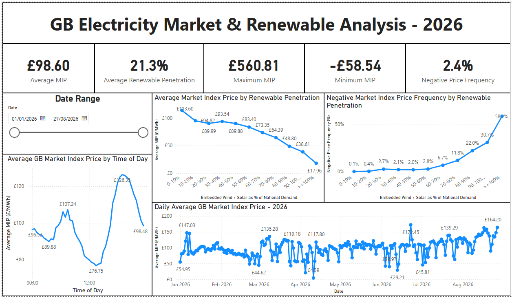

# GB Electricity Market & Renewable Analysis – 2026

## Project Overview

This project analyses Great Britain's electricity market from **1 January to 27 August 2026**, focusing on the relationship between embedded renewable generation, electricity demand and Market Index Prices (MIP).

The objective was to investigate how electricity prices change under different levels of embedded wind and solar penetration, while also examining negative pricing, intraday price patterns and daily market volatility.

## Business Questions

The analysis addresses four key questions:

1. How does embedded renewable penetration relate to GB Market Index Prices?
2. How frequently do negative prices occur at different renewable penetration levels?
3. How do electricity prices vary throughout the day?
4. How did average daily electricity prices change during the analysed 2026 period?

## Tools Used

- **Microsoft Excel** – initial data exploration and validation
- **Power Query** – data cleaning, transformation and dataset integration
- **Power BI** – data modelling, analysis and interactive dashboard development
- **DAX** – calculated measures and KPIs

## Data Sources

The project combines electricity-market data from:

- **NESO (National Energy System Operator)** – national electricity demand and embedded wind and solar generation
- **Elexon** – Market Index Price data

The datasets were transformed and combined at **settlement-date and settlement-period level**.

> **Note:** Renewable penetration in this analysis refers specifically to embedded wind and solar generation as a percentage of National Demand (ND). It should not be interpreted as total renewable generation across Great Britain.

## Data Preparation

The analytical workflow included:

- Cleaning and transforming raw electricity-market data
- Standardising settlement dates and settlement periods
- Combining NESO and Elexon datasets using Power Query
- Calculating embedded wind + solar generation
- Calculating embedded renewable penetration relative to national demand
- Creating renewable penetration bands
- Identifying negative-price settlement periods
- Creating DAX measures for market KPIs
- Building an interactive Power BI dashboard with date filtering
## Key Calculations

The following calculations were used to create the analytical variables used throughout the project.

**Embedded Renewable Generation**

Embedded Renewable Generation = Embedded Wind Generation + Embedded Solar Generation

**Embedded Renewable Penetration**

Embedded Renewable Penetration = Embedded Renewable Generation / National Demand (ND)

This represents estimated embedded wind and solar generation as a proportion of National Demand (ND).

**Negative Price Flag**

Negative Price Flag = 1 when Market Index Price < 0, otherwise 0

**Negative Price Frequency**

Negative Price Frequency = Average of Negative Price Flag

This measures the proportion of settlement periods in which the Market Index Price was negative.
## Dashboard

The dashboard tracks:

- Average Market Index Price
- Average embedded renewable penetration
- Maximum and minimum Market Index Price
- Negative-price frequency
- Average MIP by renewable penetration
- Negative-price frequency by renewable penetration
- Average MIP by time of day
- Daily average MIP
- Interactive date filtering

## Key Insights

### 1. Higher renewable penetration was associated with lower market prices

Average Market Index Price generally declined as embedded wind and solar generation increased relative to national demand.

Average MIP decreased from approximately **£113.60/MWh at 0–10% renewable penetration** to approximately **£17.96/MWh at ≥100% penetration**.

### 2. Negative prices became substantially more frequent at high renewable penetration

Negative MIP occurred in approximately **0.1% of settlement periods at 0–10% renewable penetration**.

This increased to approximately **30.7% at 90–100% penetration** and **58.2% at ≥100% penetration**.

### 3. Electricity prices displayed a clear intraday pattern

Average MIP was generally lower around the middle of the day before increasing substantially during the evening.

This highlights the importance of considering **when electricity is generated and consumed**, rather than analysing generation volumes alone.

### 4. The market exhibited substantial short-term price volatility

Across the analysed period:

| Metric | Result |
|---|---:|
| Average MIP | £98.60/MWh |
| Maximum MIP | £560.81/MWh |
| Minimum MIP | -£58.54/MWh |
| Average embedded renewable penetration | 21.3% |
| Negative-price frequency | 2.4% |

Daily average prices also displayed repeated spikes and troughs throughout the analysis period.

## Conclusion

Analysis of GB electricity-market data from **1 January to 27 August 2026** identified a clear association between embedded renewable penetration and electricity-market price behaviour.

Higher embedded wind and solar generation relative to national demand was generally associated with **lower average Market Index Prices** and a **substantially greater frequency of negative prices**.

The analysis also identified pronounced intraday and day-to-day price variation, highlighting the importance of both renewable penetration and timing when analysing electricity-market conditions.

These findings demonstrate **association rather than causation**. Electricity prices are influenced by multiple interacting factors, including electricity demand, conventional generation availability, interconnector flows, storage and wider system constraints.

## Skills Demonstrated

- Energy-market data analysis
- Data cleaning and transformation
- Power Query ETL
- Dataset integration
- DAX
- Power BI dashboard development
- Time-series analysis
- Electricity-price analysis
- Data visualisation
- Translating analytical results into market insights

## Future Development

Potential extensions include:

- SQL-based querying and analysis
- Python-based statistical analysis
- Analysis of interconnector flows
- Seasonal renewable-generation analysis
- Demand-price modelling
- Further investigation of extreme and negative-price events

## Author

**Basil Nwosu**

MSc Applied Geosciences graduate developing expertise in **energy data analytics**, with a focus on electricity markets, data analysis and business intelligence.
